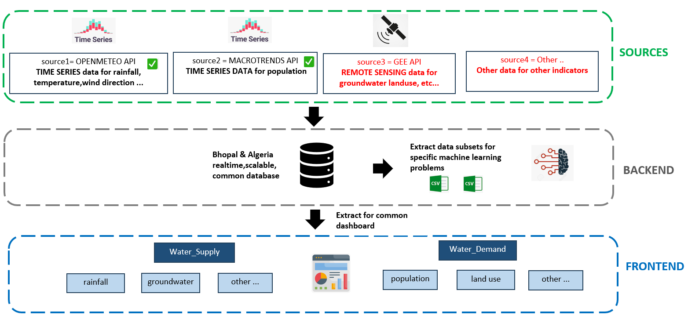
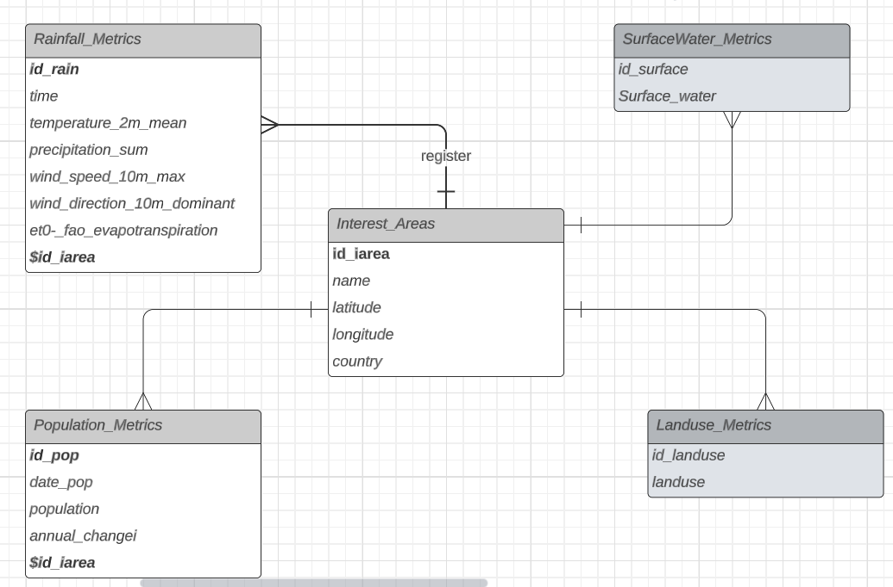
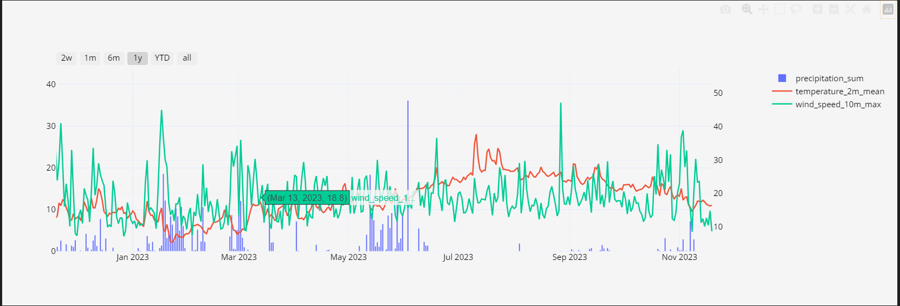

# Open Source Water Management and Forecasting

##  Sources and dataflows 
This is a mutualised repository for Omdena Water Scarcity project. Here is an overview of the ongoing/possible dataflows.
 

## Central Database 
This an idea of a central database (see data folders in this repo). 
 

## Exploratory Data Analysis 

Plotly graphs with divers types at :[plotly graphing library](https://plotly.com/python/) 

 

## Machine Learning 

To implement in the next phase.
