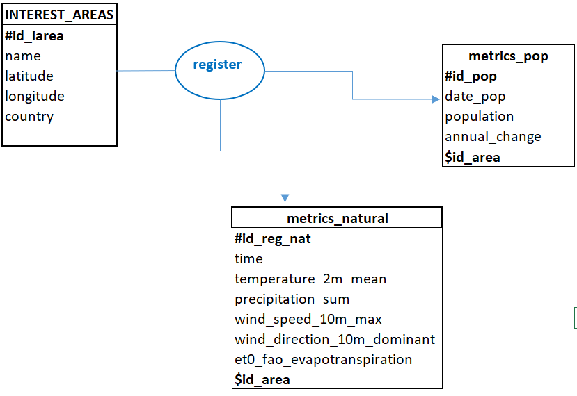
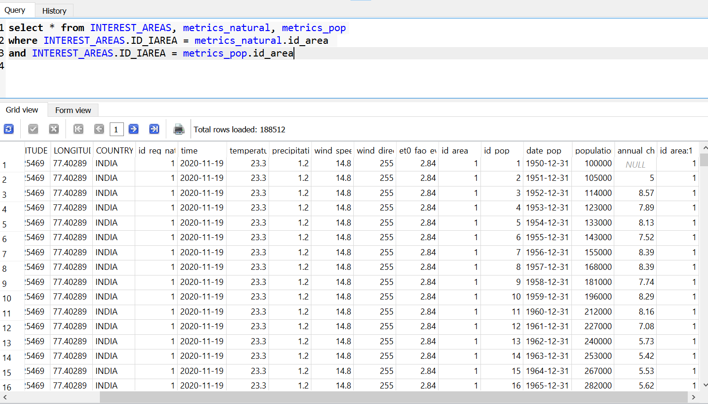
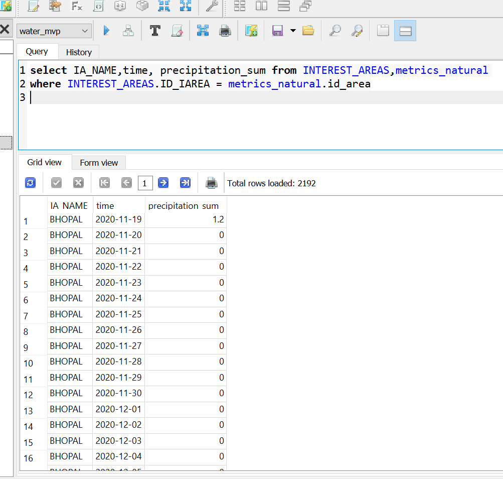

# Water Scarcity Backend MVP
Backend data ideas and implementations for water scarcity app
## Data integration from different sources & benefits 
Integration of different sources and types (api calls for time series, remote sensing, etc.. ) into one instance. 
The benefits is one common, scalable and realtime database for Algeria and Bhopal. We then query it to extract data subsets for required for a task in particular. 

  

## Possible Datalake schema
A schema that can answer our project questions is here : 
  

## Implemented aspects for data backend
The data queries can be extracted and some examples in csv formats available here in github https://github.com/EmanuelAfessa/omdena_water_scarcity

 
 

A front test on a small python analytics app :
 