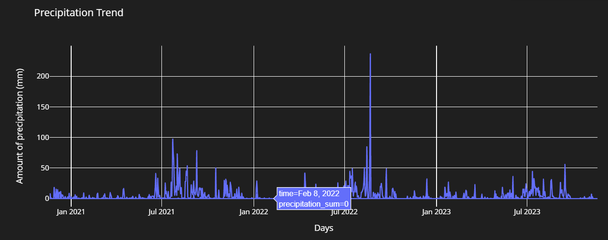

# Open Source Water Management and Forecasting

## Central Database 
One central database (see data folders in this repo)
 

## Exploratory Data Analysis 

Plotly graphs with divers types at :[plotly graphing library](https://plotly.com/python/) 

 

## Machine Learning 

To implement next phase
